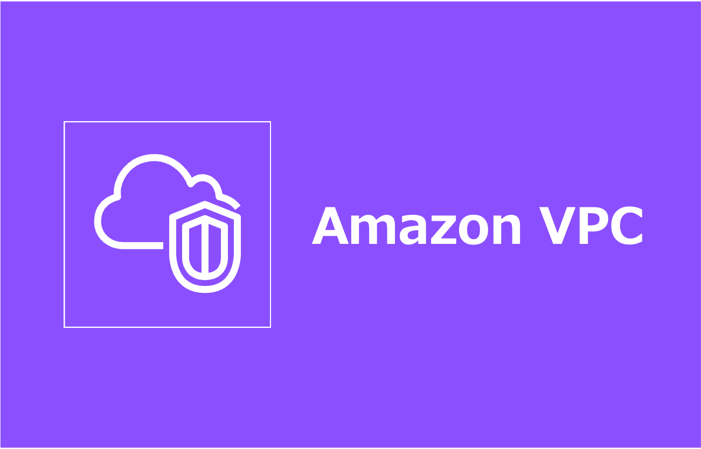
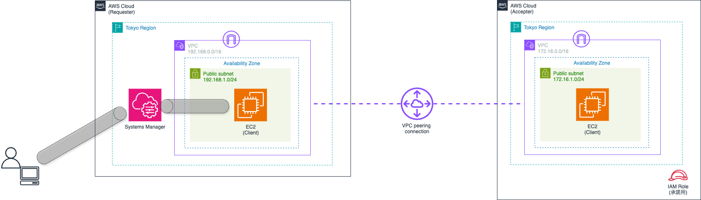

=====================================================================
クロスアカウントの同一リージョン VPC ピアリングを CloudFormation で構築
=====================================================================

=====================================================================
構成図
=====================================================================

=====================================================================
デプロイ - CloudFormation -
=====================================================================

作業環境 - ローカル -
=====================================================================
* macOS Tahoe ( v26.2 )
* Visual Studio Code 1.108.2
* Rain v1.24.2
* aws-cli 2.33.12

フォルダ構成
=====================================================================
* `こちら <./folder.md>`_ を参照

前提条件
=====================================================================
* AWS アカウントを 2 つ所持していること
* 各AWS アカウントにて *AdministratorAccess* がアタッチされているIAMユーザーを作成していること
* 実作業は *envs* フォルダ配下で実施すること
* 以下コマンドを実行し、各AWS アカウントのプロファイルを作成していること (デフォルトリージョンは *ap-northeast-1* )

.. code-block:: bash

  aws login --profile admin_accepter

.. code-block:: bash

  aws login --profile admin_requester

事前作業(1)
=====================================================================
1. 各種モジュールインストール
---------------------------------------------------------------------
* `GitHub <https://github.com/tyskJ/common-environment-setup>`_ を参照

事前作業(2)
=====================================================================
1. デプロイ用バケット作成
---------------------------------------------------------------------
* アクセプタアカウント用

.. code-block:: bash

  aws s3 mb \
  s3://cfn-working-accepter-apne1 \
  --profile admin_accepter

* リクエスタアカウント用

.. code-block:: bash

  aws s3 mb \
  s3://cfn-working-requester-apne1 \
  --profile admin_requester

.. note::

  * バケット名は、全世界で一意である必要があります
  * 作成に失敗した場合は、バケット名を修正してください

実作業 - ローカル -
=====================================================================
1. スタックデプロイ (アクセプタアカウント)
---------------------------------------------------------------------
* 変数ファイル作成

.. code-block:: bash

  cat <<EOF > config/accepter-parameter.yml
  Parameters:
    RequesterAccountId: リクエスタAWSアカウントID
  EOF

* ACCEPTER スタックデプロイ

.. code-block:: bash

  rain deploy accepter.yml ACCEPTER \
  --s3-bucket cfn-working-accepter-apne1 \
  --config config/accepter-parameter.yml \
  --profile admin_accepter -y

.. note::

  * S3バケット名は必要に応じて修正してください

2. スタックデプロイ (リクエスタアカウント)
---------------------------------------------------------------------
* 変数ファイル作成

.. code-block:: bash

  cat <<EOF > config/requester-parameter.yml
  Parameters:
    AccepterAccountId: アクセプタAWSアカウントID
    AccepterRoleArn: アクセプタAWSアカウントに作成したピアリング承諾用IAMロールARN
    AccepterVpcId: VPC ピアリングするアクセプタAWSアカウントに作成したVPC ID
  EOF

* REQUESTER スタックデプロイ

.. code-block:: bash

  rain deploy requester.yml REQUESTER \
  --s3-bucket cfn-working-requester-apne1 \
  --config config/requester-parameter.yml \
  --profile admin_requester -y

.. note::

  * S3バケット名は必要に応じて修正してください

3. ルート追加 (アクセプタアカウント)
---------------------------------------------------------------------
.. code-block:: bash

  aws ec2 create-route \
  --route-table-id アクセプタアカウントルートテーブルID \
  --destination-cidr-block 192.168.0.0/16 \
  --vpc-peering-connection-id PeeringConnectionID \
  --profile admin_accepter

動作確認
=====================================================================
* `詳細 <./envs/README.rst>`_

後片付け - ローカル -
=====================================================================
1. スタック削除
---------------------------------------------------------------------
.. code-block:: bash

  rain rm ACCEPTER --profile admin_accepter -y

.. code-block:: bash

  rain rm REQUESTER --profile admin_requester -y

2. デプロイ用バケット削除
---------------------------------------------------------------------
.. code-block:: bash

  aws s3 rm --recursive s3://cfn-working-accepter-apne1 --profile admin_accepter
  aws s3 rb s3://cfn-working-accepter-apne1 --profile admin_accepter

.. code-block:: bash

  aws s3 rm --recursive s3://cfn-working-requester-apne1 --profile admin_requester
  aws s3 rb s3://cfn-working-requester-apne1 --profile admin_requester

.. note::

  * S3バケット名は必要に応じて修正してください

参考資料
=====================================================================
リファレンス
---------------------------------------------------------------------
* `AWS リソースおよびプロパティタイプのリファレンス - Template Reference <https://docs.aws.amazon.com/ja_jp/AWSCloudFormation/latest/TemplateReference/aws-template-resource-type-ref.html>`_
